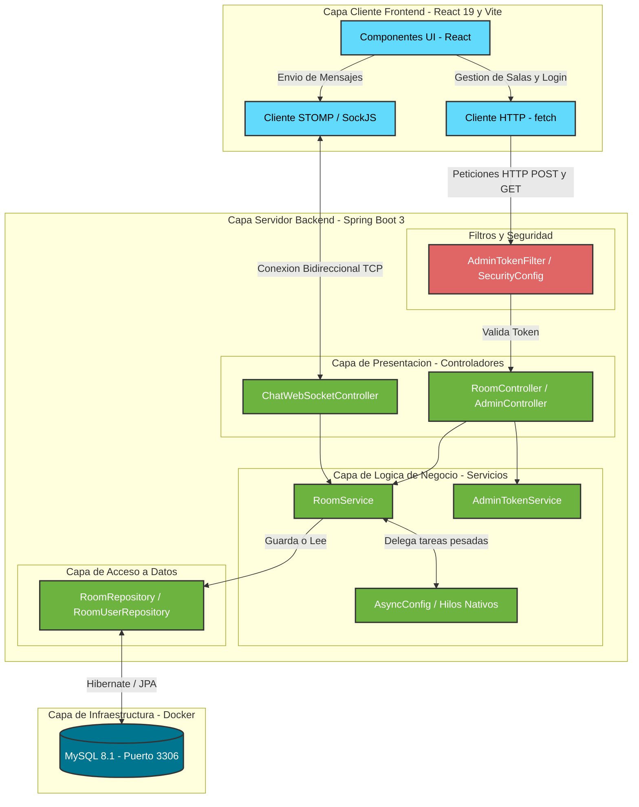
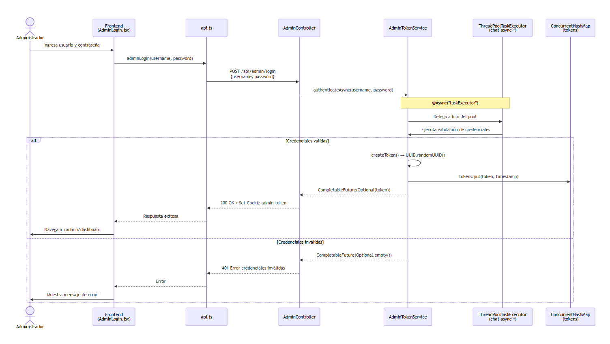
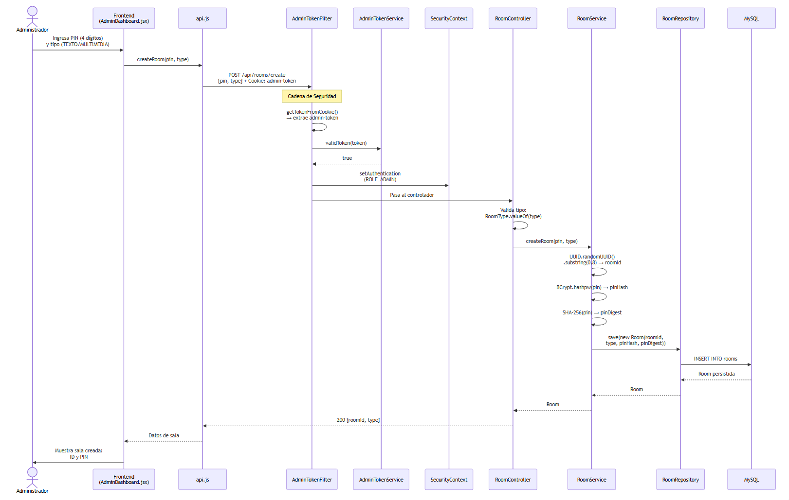
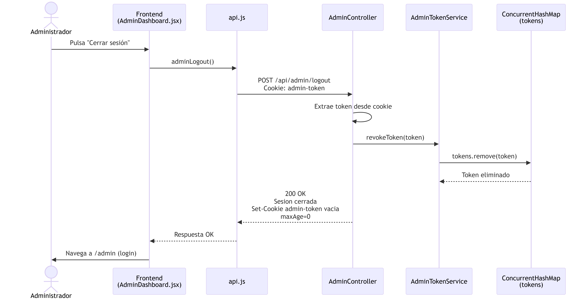
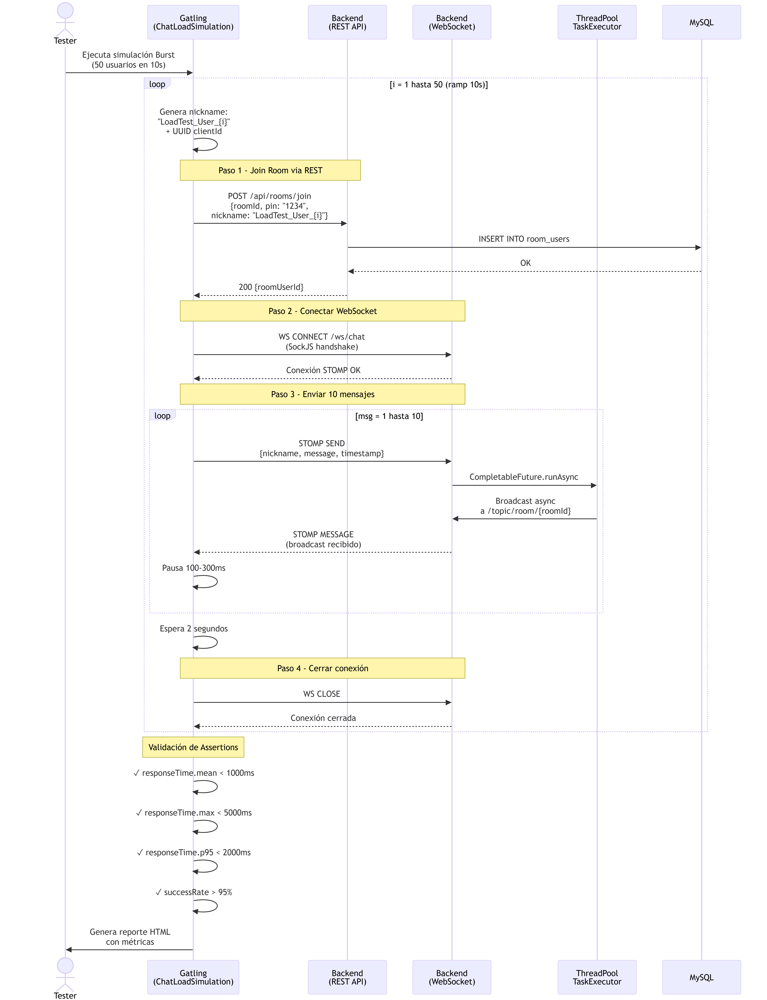

# Chat Seguro Spring Boot & React

Sistema completo de chat en tiempo real con salas seguras, autenticación de administrador y manejo de archivos. Desarrollado con **Spring Boot 3** (Backend) y **React + Vite** (Frontend).

## 📋 Descripción del Proyecto

Desarrollo de un aplicativo de chat en tiempo real que permite la gestion de salas de conversacion seguras y colaborativas. La aplicacion cuenta con un backend (Java/Spring Boot) que maneja la logica, seguridad y persistencia; y un frontend responsivo (React) para una interfaz de usuario moderna e intuitiva.

**Objetivo y alcance:** ofrecer mensajeria en tiempo real con control de acceso por PIN, administracion de salas y soporte de archivos (segun el tipo de sala), con persistencia en MySQL y comunicacion WebSocket.

### Características Principales:

- **Gestión de Administrador:** Login seguro para crear salas.
- **Salas Seguras:** Acceso mediante PIN de 4 dígitos (con hasheo BCrypt + búsqueda O(1) vía SHA-256).
- **Tipos de Sala:** `TEXTO` (solo mensajes) y `MULTIMEDIA` (mensajes y archivos).
- **Control de Acceso:** Nicknames únicos por sala y sesión única por dispositivo (`deviceId`). Los usuarios pueden cambiar de sala sin problemas.
- **WebSocket:** Mensajería en tiempo real usando STOMP sobre SockJS.
- **Archivos:** Subida segura con validación de tipo MIME y tamaño, servidos estáticamente.

---

## 🛠️ Tecnologías Utilizadas

- **Backend:** Java 21, Spring Boot 3, Spring Security, Spring Data JPA
- **Frontend:** React, Vite
- **Base de Datos:** MySQL, Docker & Docker Compose
- **Comunicación:** WebSocket, STOMP, SockJS
- **Pruebas de Carga:** Gatling (Scala)

---

## 🏗️ Arquitectura del Sistema

El sistema sigue una arquitectura cliente-servidor con comunicación REST para operaciones CRUD/Auth y WebSockets (STOMP) para mensajería full-duplex.



---

## 🧩 Diagramas

Los diagramas de secuencia se encuentran en la carpeta de diagramas. Cada archivo describe el flujo de un caso de uso:

- [Diagrama 1 - Autenticacion y administracion de login](AppDistribuidas/Parcial%20I/Proyecto/Diagrama_Secuencia/Diagrama1_Autenticacion_Administracion_Login.txt)
- [Diagrama 2 - Creacion de sala de chat](AppDistribuidas/Parcial%20I/Proyecto/Diagrama_Secuencia/Diagrama2_Creacion_Sala_Chat.txt)
- [Diagrama 3 - Conexion de usuario a sala](AppDistribuidas/Parcial%20I/Proyecto/Diagrama_Secuencia/Diagrama3_Conexion_Usuario_Sala.txt)
- [Diagrama 4 - Envio y recepcion de mensajes](AppDistribuidas/Parcial%20I/Proyecto/Diagrama_Secuencia/Diagrama4_EnvioRecepcion_Mensaje_WebSocket.txt)
- [Diagrama 5 - Subida de archivos en chat](AppDistribuidas/Parcial%20I/Proyecto/Diagrama_Secuencia/Diagrama5_Subida_Archivos_Chat.txt)
- [Diagrama 6 - Logout administrador](AppDistribuidas/Parcial%20I/Proyecto/Diagrama_Secuencia/Diagrama6_LogOut_Admin.txt)
- [Diagrama 7 - Flujo de pruebas de carga](AppDistribuidas/Parcial%20I/Proyecto/Diagrama_Secuencia/Diagrama7_LoadTest.txt)

### Vista rapida (imagenes)








---

## 📁 Estructura del Proyecto

```text
Proyecto/
├── ChatSeguroSpring/   # Backend Spring Boot y base de datos (docker-compose.yml)
│   ├── src/            # Codigo fuente del backend
│   ├── uploads/        # Archivos subidos (modo desarrollo)
│   └── docker-compose.yml
├── chat-frontend/      # Frontend React + Vite
│   ├── src/            # Componentes y vistas de la UI
│   └── vite.config.js  # Proxy a backend (/api, /ws, /uploads)
├── chat-load-tests/    # Pruebas de carga Gatling (Scala)
│   └── src/            # Simulaciones y escenarios
├── Diagrama_Secuencia/ # Diagramas de secuencia
└── Requerimientos/     # Documentacion de requisitos
```

---

## ⚙️ Requisitos Previos

- **Java 21**
- **Maven**
- **Node.js 22+** y **npm**
- **Docker y Docker Compose** (para la base de datos)

---

## 🚀 Instalación y Despliegue

### 1. Iniciar la Base de Datos (MySQL)

```bash
cd "AppDistribuidas/Parcial I/Proyecto/ChatSeguroSpring"
docker compose up -d
```

### 2. Configurar el Entorno

Las variables de entorno se leen del archivo `.env` en el directorio raíz del backend. Asegúrate de tenerlo configurado:

- `MYSQL_ROOT_PASSWORD`
- `MYSQL_DATABASE` / `MYSQL_PORT` (Configuración de DB)
- `SPRING_DATASOURCE_URL` / `SPRING_DATASOURCE_USERNAME` / `SPRING_DATASOURCE_PASSWORD` (Configuración de conexión JDBC para Spring Boot)
- `CHAT_ADMIN_USERNAME` / `CHAT_ADMIN_PASSWORD` (Credenciales del admin)
- `CHAT_UPLOAD_ALLOWED_TYPES` / `CHAT_UPLOAD_MAX_SIZE` (Configuración de multimedia)

#### Descripción de variables

- `CHAT_UPLOAD_ALLOWED_TYPES`: Tipos MIME permitidos para subida de archivos.
- `CHAT_UPLOAD_MAX_SIZE`: Tamaño máximo permitido en bytes

### 3. Ejecutar el Backend (Spring Boot)

```bash
# Estando en el directorio del backend (ChatSeguroSpring)
mvn spring-boot:run
```

El backend estará escuchando en `http://localhost:8080`.

### 4. Ejecutar el Frontend (React)

En una nueva terminal, navega a la carpeta del frontend y levanta el servidor de desarrollo:

```bash
cd "AppDistribuidas/Parcial I/Proyecto/chat-frontend"
npm install
npm run dev
```

El frontend estará disponible en **`http://localhost:5173`**.

_(El frontend incluye un proxy configurado en `vite.config.js` que enruta automáticamente las peticiones `/api`, `/ws` y `/uploads` hacia el backend en el puerto 8080 para evitar problemas de CORS)._

---

## 📖 Guía de Uso

1. **Acceso Administrador:**
   - Navega a `http://localhost:5173/admin`
   - Ingresa con las credenciales del `.env` (ej. `admin` / `Admin123!`).
   - Crea salas especificando un PIN de 4 dígitos y el tipo de sala (Texto o Multimedia).

2. **Acceso Usuario:**
   - Navega a `http://localhost:5173/`
   - Ingresa el PIN de la sala previamente creada y un nickname.
   - Serás redirigido a la sala en tiempo real.
   - Si la sala es multimedia, podrás adjuntar y enviar archivos (PNG, JPEG, PDF, etc.) de hasta 10MB.
   - Puedes abrir múltiples pestañas o navegadores para simular varios usuarios chateando simultáneamente.

---

## 🛡️ Seguridad Implementada

- **Criptografía de PINs:** Almacenamiento en base de datos usando un digest **SHA-256** (para búsquedas optimizadas O(1)) y validación final segura con **BCrypt** para almacenamiento seguro y protección contra fuerza bruta.
- **Control de Acceso (WebSocket):** El servidor verifica que el `nickname` que intenta enviar un mensaje a través de STOMP realmente pertenezca a la sala (`RoomService.isMember()`), evitando falsificación de identidad (spoofing).
- **Manejo de Sesiones:** Cookie-based `deviceId` para asegurar que un dispositivo/pestaña no ocupe más de un usuario a la vez, con auto-limpieza al cambiar de sala.
- **Validación Multimedia:** Restricción por tipo MIME (`Content-Type`) configurado desde `.env`, no confiando solo en la extensión del archivo. Las salas de `TEXTO` bloquean uploads a nivel de backend.
