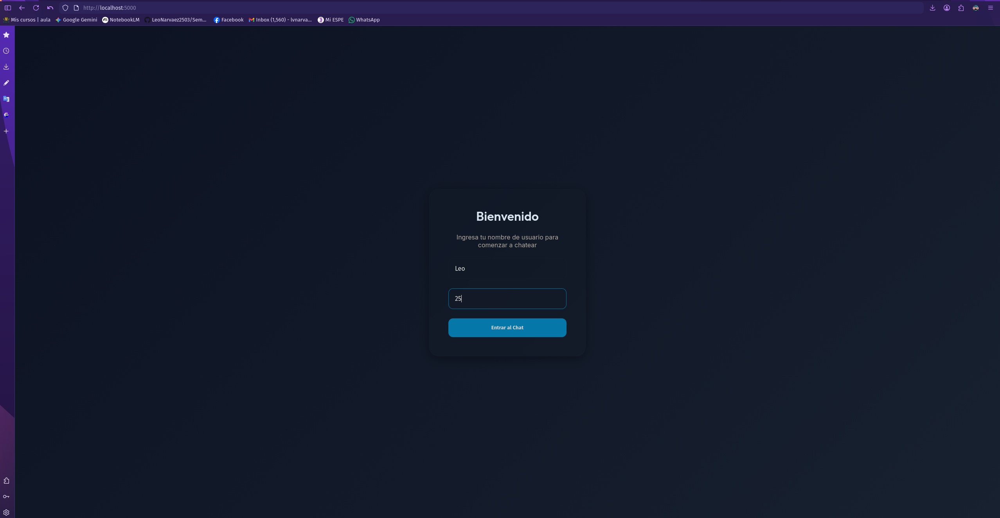
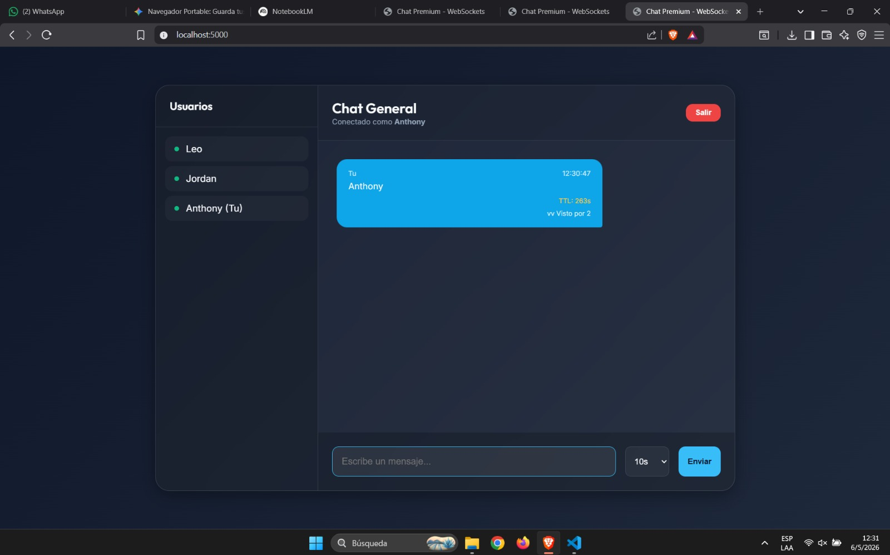

# Sistema de Mensajería en Tiempo Real

## Información del Proyecto
- **Integrantes:** 
    - Caetano Flores
    - Jordan Guaman
    - Anthony Morales
    - Leonardo Narváez
- **Fecha:** 2026-05-06

Este taller es un sistema de mensajería privada en tiempo real desarrollado con Flask y Flask-SocketIO. Permite a los usuarios comunicarse en salas privadas, con funcionalidades como confirmaciones de lectura y mensajes temporales con TTL configurable. No utiliza persistencia en base de datos, almacenando los datos únicamente en memoria durante la sesión activa.


# Descarga y Acceso al Proyecto

Puedes descargar únicamente la carpeta del proyecto desde el siguiente enlace:

**Repositorio:** [WebSockets - MeatPuppets](https://github.com/LeoNarvaez2503/Semestre-VII/tree/MeatPuppets/AppDistribuidas/Parcial%20I/WebSockets)

Una vez descargado el repositorio o la carpeta, ubícate en la carpeta `WebSockets` antes de ejecutar cualquier comando. Puedes hacerlo de la siguiente manera:

### Acceso a la carpeta WebSockets

Ubícate en la carpeta del proyecto antes de ejecutar cualquier comando. Si descargaste el repositorio completo, navega hasta:

```
cd "AppDistribuidas/Parcial I/WebSockets"
```

> **Nota:**
> - Usa la ruta relativa anterior desde donde descomprimiste o clonaste el repositorio, funciona igual en Windows, Linux y Mac.

## Funcionalidades Principales

1. **Login con Nickname y Sala Privada:**
   - Los usuarios deben ingresar un nickname único por sala.
   - Cada sala es privada y los mensajes solo son visibles para los usuarios dentro de la misma.

2. **Mensajes por Sala:**
   - Los mensajes enviados se distribuyen únicamente a los usuarios de la sala correspondiente.

3. **Confirmaciones de Lectura:**
   - El emisor puede ver cuándo el receptor ha leído un mensaje.

4. **Mensajes Temporales:**
   - Los mensajes tienen un Tiempo de Vida (TTL) configurable: 10 segundos, 1 minuto o 5 minutos.
   - Una cuenta regresiva visible muestra el tiempo restante antes de que el mensaje desaparezca.

---


*** End Patch


      
## Instrucciones de Instalación y Ejecución

### 1. Configuración del Entorno

1. Desde la carpeta `WebSockets`, crea un entorno virtual:
   ```bash
   python -m venv venv
   ```
2. Activa el entorno virtual:
    - En Windows:
       ```bash
       .\venv\Scripts\activate
       ```
    - En Linux/Mac:
       ```bash
       source venv/bin/activate
       ```

### 2. Instalación de Dependencias

Instala las dependencias necesarias:
```bash
pip install Flask Flask-SocketIO eventlet Flask-Cors
```

### 3. Ejecución del Servidor

Inicia el servidor desde la carpeta `WebSockets` con el siguiente comando:
```bash
python server.py
```

### 4. Acceso a la Aplicación

Abrir un navegador web y acceder a la URL:
```
http://localhost:5000
```

---

## Guía de Uso

### 1. Inicio de Sesión
- Ingresar un nickname único y seleccionar una sala.
- Hacer clic en "Entrar" para unirse al chat.



### 2. Enviar Mensajes
- Escribir un mensaje en el campo de texto.
- Seleccionar un TTL (Tiempo de Vida) para el mensaje.
- Hacer clic en "Enviar" para enviar el mensaje.

### 3. Confirmaciones de Lectura
- Los mensajes enviados mostrarán un indicador:
  - `✓`: Enviado.
  - `✓✓`: Leído por el receptor.



### 4. Mensajes Temporales
- Los mensajes desaparecerán automáticamente después de que expire el TTL configurado.

---

## Explicación Técnica

### Mensajes Temporales
- El cliente envía el TTL seleccionado (10, 60, 300 segundos) junto con cada mensaje.
- El cliente calcula la hora de expiración (`expiresAt`) y muestra una cuenta regresiva.
- El mensaje se elimina automáticamente de la interfaz de usuario al finalizar el TTL.
- El servidor almacena únicamente metadatos mínimos (ID, remitente, sala, hora de expiración) y los elimina de la memoria tras el TTL.

### Confirmaciones de Lectura
- Cuando un usuario marca un mensaje como leído, el cliente emite el evento `readMessage`.
- El servidor reenvía el evento `messageRead` únicamente al emisor original del mensaje.
- La interfaz de usuario actualiza el estado del mensaje con un indicador visual.

### Eventos SocketIO
- **`connect`**: Inicia la sesión de socket.
- **`set_username`**: Registra el nickname y la sala.
- **`user_joined` / `user_left`**: Notifica cambios de usuarios en la sala.
- **`user_list`**: Proporciona la lista de usuarios activos en la sala.
- **`chatMessage`**: Entrega mensajes en la sala.
- **`readMessage`**: Confirma la lectura desde el receptor.
- **`messageRead`**: Reenvía la confirmación al emisor.

---

