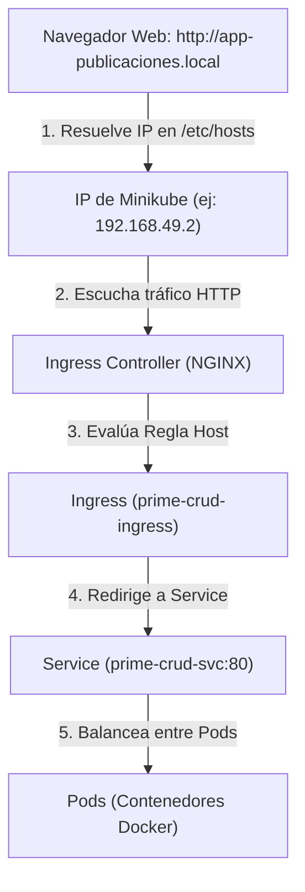

# Conceptos Fundamentales de Kubernetes (Taller Práctico)

Este documento resume los conceptos clave, arquitectura y flujo de funcionamiento de Kubernetes aprendidos durante el despliegue práctico en entorno local.

---

## 1. Arquitectura y Flujo de Red Local

Cuando un usuario navega a un dominio personalizado como `http://app-publicaciones.local`, el tráfico atraviesa la siguiente arquitectura:



---

## 2. Herramientas del Entorno

### **Minikube**
Herramienta que ejecuta un clúster de Kubernetes de un solo nodo dentro de un contenedor Docker o máquina virtual local. Simula la infraestructura de producción en tu PC.

### **`kubectl`**
Línea de comandos (CLI) oficial para enviar instrucciones declarativas (archivos `.yml`) u órdenes imperativas a la API del clúster Kubernetes.

---

## 3. Objetos Fundamentales de Kubernetes

### **1. Namespace (`Kind: Namespace`)**
* **¿Qué es?** Un aislamiento lógico o "carpeta virtual" dentro del clúster.
* **Función:** Agrupa y separa recursos (Pods, Deployments, Services) de distintas aplicaciones para evitar colisiones de nombres.
* **Ejemplo:** `prime-crud-ns`, `ejemplo`.

### **2. Pod**
* **¿Qué es?** La unidad ejecutable más pequeña en Kubernetes.
* **Función:** Envuelve uno o más contenedores Docker que comparten la misma dirección IP interna y almacenamiento.

### **3. Deployment (`Kind: Deployment`)**
* **¿Qué es?** El gestor declarativo del ciclo de vida de los Pods.
* **Función:**
  * Define la **imagen Docker** que se descargará desde un registro (ej. Docker Hub).
  * Mantiene el número deseado de copias (**réplicas**).
  * Realiza **auto-recuperación**: Si un Pod falla o muere, crea uno nuevo automáticamente.
  * Facilita **actualizaciones sin caída** (Rolling Updates).

### **4. Service (`Kind: Service`)**
* **¿Qué es?** Una abstracción de red que ofrece una IP y DNS estables para un grupo de Pods.
* **Función:** Dado que los Pods son efímeros y su IP cambia al reiniciarse, el Service actúa como punto de acceso permanente y **balanceador de carga**.
* **Tipos de Service:**
  * `ClusterIP`: IP interna accesible únicamente desde dentro del clúster.
  * `NodePort`: Expone la aplicación en un puerto específico de la máquina nodo (rango 30000-32767).
  * `LoadBalancer`: Solicita un balanceador de carga externo en proveedores de nube (AWS, GCP, Azure).

### **5. Ingress (`Kind: Ingress`)**
* **¿Qué es?** Un enrutador HTTP/HTTPS de Nivel 7 (capa de aplicación).
* **Función:**
  * Define reglas de host (dominios como `app-publicaciones.local`) y rutas (`/`).
  * Evita exponer múltiples puertos `NodePort` y centraliza el acceso HTTP en el puerto 80/443.

### **6. PersistentVolumeClaim (`Kind: PersistentVolumeClaim` / PVC)**
* **¿Qué es?** Una solicitud de almacenamiento persistente en el clúster.
* **Función:** Garantiza que los datos (por ejemplo, una base de datos MongoDB) no se pierdan al reiniciar o eliminar Pods.

---

## 4. Estructura Típica de un Despliegue en YAML

### **A. Namespace**
```yaml
apiVersion: v1
kind: Namespace
metadata:
  name: prime-crud-ns
```

### **B. Deployment**
```yaml
apiVersion: apps/v1
kind: Deployment
metadata:
  name: prime-crud
  namespace: prime-crud-ns
spec:
  replicas: 2
  selector:
    matchLabels:
      app: prime-crud
  template:
    metadata:
      labels:
        app: prime-crud
    spec:
      containers:
        - name: app
          image: agcudco/ejemplo-prime-crud:latest # Imagen descargada de Docker Hub
          ports:
            - containerPort: 80
```

### **C. Service**
```yaml
apiVersion: v1
kind: Service
metadata:
  name: prime-crud-svc
  namespace: prime-crud-ns
spec:
  selector:
    app: prime-crud
  ports:
    - port: 80
      targetPort: 80
  type: ClusterIP
```

### **D. Ingress**
```yaml
apiVersion: networking.k8s.io/v1
kind: Ingress
metadata:
  name: prime-crud-ingress
  namespace: prime-crud-ns
spec:
  ingressClassName: nginx
  rules:
    - host: app-publicaciones.local
      http:
        paths:
          - path: /
            pathType: Prefix
            backend:
              service:
                name: prime-crud-svc
                port:
                  number: 80
```

---

## 5. Resumen de Comandos Esenciales

```bash
# Iniciar clúster
minikube start --driver=docker

# Activar módulo Ingress
minikube addons enable ingress

# Aplicar configuraciones YAML
kubectl apply -f <archivo_o_directorio>

# Inspeccionar estado de componentes
kubectl get nodes
kubectl get pods -n <namespace>
kubectl get svc -n <namespace>
kubectl get ingress -n <namespace>

# Abrir túnel para Ingress en Docker driver (Linux)
minikube tunnel
```
