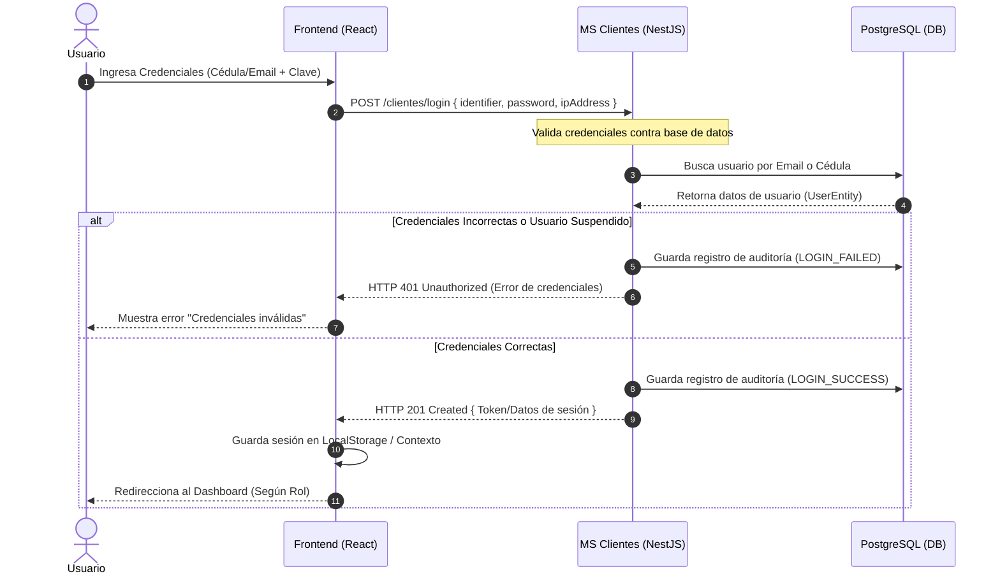
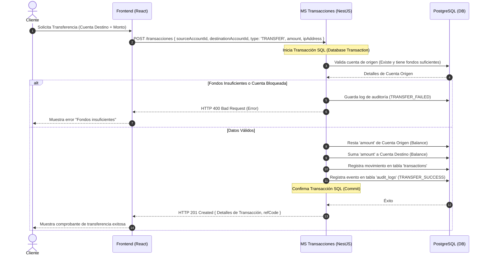
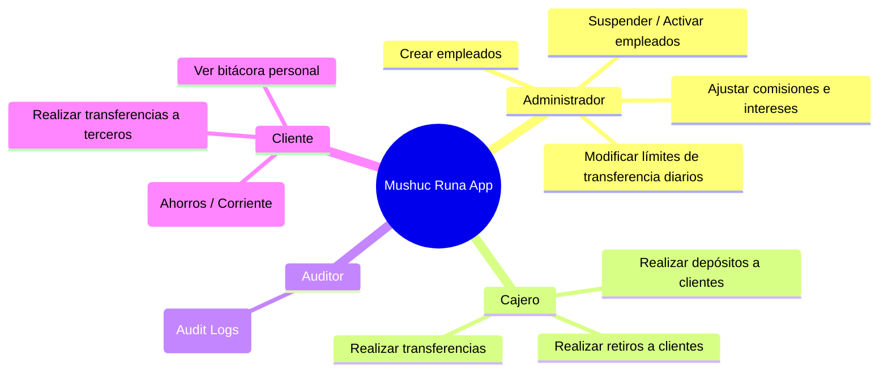

# Diagramas de Flujo del Sistema (Mushuc Runa)

Esta guía documenta los flujos principales del sistema (Arquitectura, Autenticación y Transacciones) mediante diagramas en formato **Mermaid**. Puedes visualizar estos diagramas directamente en lectores de Markdown compatibles (como GitHub, VS Code, etc.).

---

## 1. Arquitectura General y Flujo de Componentes

Este diagrama describe cómo interactúan los activos de red desde el navegador del cliente hasta la base de datos a través de los microservicios:

```mermaid
graph TD
    subgraph Cliente (Navegador/Host)
        FE[Frontend React SPA - Puerto 3000]
    end

    subgraph Red Interna de Docker (Hardened)
        DB[(Base de Datos PostgreSQL - Puerto 5432)]
        
        MS_CLI[Microservicio Clientes - Puerto 4001]
        MS_CTA[Microservicio Cuentas - Puerto 4002]
        MS_TX[Microservicio Transacciones - Puerto 4003]
    end

    FE -->|API Call /clientes| MS_CLI
    FE -->|API Call /cuentas| MS_CTA
    FE -->|API Call /transacciones| MS_TX

    MS_CLI -->|TypeORM / TCP| DB
    MS_CTA -->|TypeORM / TCP| DB
    MS_TX -->|TypeORM / TCP| DB

    style DB fill:#f9f,stroke:#333,stroke-width:2px
    style FE fill:#bbf,stroke:#333,stroke-width:2px
```

---

## 2. Flujo de Autenticación (Login)

Flujo detallado desde que el usuario ingresa sus credenciales en la interfaz hasta que se valida e inicia la auditoría:



---

## 3. Flujo Transaccional (Transferencia entre Cuentas)

Este diagrama muestra cómo viaja una transferencia de dinero y cómo interactúan las APIs de Transacciones y Base de Datos garantizando los registros contables y la bitácora de auditoría:



---

## 4. Flujo de Roles y Acciones en el Sistema

Este mapa conceptual detalla las actividades que cada rol de usuario puede desencadenar dentro de la plataforma:


